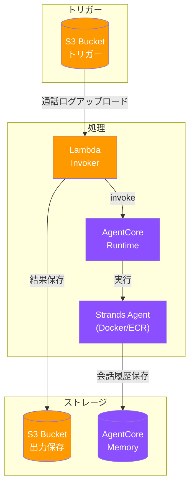
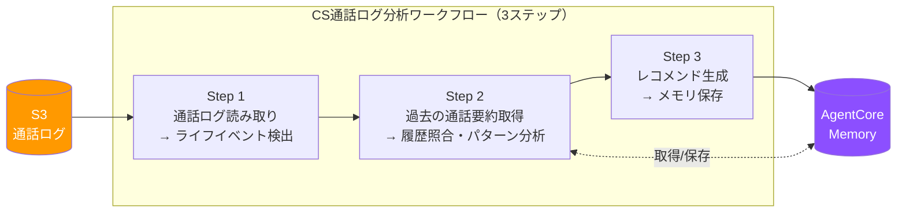

# アーキテクチャ

このドキュメントでは、プロジェクトのアーキテクチャについて説明します。

## システム構成図



## コンポーネント

### AgentCore Runtime

AWSが提供するマネージドエージェントホスティングサービス。

- ECRからコンテナイメージを取得して実行
- エンドポイントを通じてエージェントを呼び出し可能
- バージョン管理機能を提供

### Strands Agent（Docker/ECR）

実際のエージェントロジックを実装したコンテナ。

| ファイル | 説明 |
|---------|------|
| `app/main.py` | AgentCoreから呼び出される `handler()` 関数 |
| `app/config.py` | 設定モジュール（環境変数、バリデーション） |
| `app/memory.py` | AgentCore Memory統合設定 |
| `app/tools.py` | カスタムツール（@toolデコレータ付き、エージェントから呼び出し可能） |
| `app/workflow.py` | CS通話ログ分析ワークフロー（3ステップ処理） |
| `app/server.py` | FastAPIサーバー（コンテナ内エンドポイント） |
| `app/prompts/` | プロンプトテンプレート |

### AgentCore Memory

エージェントの長期記憶を管理するサービス。

- セッション間で情報を永続化
- ログ・トレース配信設定でオブザーバビリティを確保

### Lambda Invoker

S3イベントをトリガーにAgentCoreを呼び出すLambda関数。

- S3に通話ログがアップロードされると起動
- AgentCore Runtimeのエンドポイントを呼び出し
- エージェントのレスポンスをS3に保存（`outputs/`配下）

#### S3出力機能

エージェントの処理結果は自動的にS3に保存されます：

- **出力先**: `s3://{OUTPUT_BUCKET}/outputs/{timestamp}_{session_id}.json`
- **出力形式**:
  ```json
  {
    "timestamp": "2026-01-03T12:00:00Z",
    "session_id": "bucket_path_to_file",
    "actor_id": "customer-id-from-metadata",
    "source": {
      "bucket": "入力バケット名",
      "key": "入力ファイルキー"
    },
    "input": "エージェントへの入力テキスト",
    "response": "エージェントからの応答"
  }
  ```

## プロジェクト構成

```
.
├── app/
│   ├── main.py          # エントリーポイント（handler関数）
│   ├── config.py        # 設定モジュール（環境変数管理）
│   ├── memory.py        # AgentCore Memory統合設定
│   ├── tools.py         # カスタムツール（@toolデコレータ付き）
│   ├── workflow.py      # CS通話ログ分析ワークフロー
│   ├── server.py        # FastAPIサーバー
│   └── prompts/         # プロンプトテンプレート
│       └── workflow/
│           ├── system.md    # システムプロンプト
│           ├── step1.md     # ライフイベント検出用
│           ├── step2.md     # 履歴照合・パターン分析用
│           └── step3.md     # レコメンド生成用
├── terraform/
│   ├── agentcore.tf     # AgentCore RuntimeとMemoryリソース
│   ├── ecr.tf           # ECRリポジトリ
│   ├── iam.tf           # IAMロールとポリシー
│   ├── lambda.tf        # Lambda関数（S3トリガー用）
│   ├── s3.tf            # S3トリガーバケット
│   ├── observability.tf # ログ・トレース配信設定
│   ├── locals.tf        # ローカル変数定義
│   ├── outputs.tf       # Terraform出力
│   ├── backend.tf       # Terraformステート管理
│   ├── variables.tf     # プロジェクト設定
│   └── versions.tf      # Terraformバージョン指定
├── lambda/
│   └── invoker.py       # S3イベントからAgentCoreを呼び出すLambda
├── tests/               # テストコード
├── docs/                # ドキュメント
├── .claude/agents/      # サブエージェント定義
├── Dockerfile           # コンテナイメージ定義
├── Makefile             # 便利なコマンド集
└── pyproject.toml       # Python依存関係
```

## Terraformリソース

### agentcore.tf

- `aws_bedrockagentcore_agent_runtime` - AgentCore Runtime
- `aws_bedrockagentcore_memory` - AgentCore Memory
- `aws_bedrockagentcore_memory_strategy` - Memory Strategy（通話要約・ライフイベント追跡）
- エンドポイント設定（DEFAULT, PROD）

### observability.tf

- ログ配信設定（APPLICATION_LOGS, USAGE_LOGS）
- トレース配信設定（X-Ray）

### ecr.tf

- `aws_ecr_repository` - Dockerイメージ用リポジトリ

### iam.tf

- AgentCore用のIAMロール
- Bedrock、ECR、CloudWatch Logsへのアクセス権限

### lambda.tf / s3.tf

- S3トリガー用のLambda関数
- トリガー用S3バケット

## イベント構造

AgentCoreはエージェントを以下の形式で呼び出します（CS通話ログ分析モードのみサポート）：

```python
{
  "input": {
    "text": "通話ログを分析してください"
  },
  "s3_info": {
    "bucket": "bucket-name",
    "key": "path/to/call-log.txt"
  },
  "sessionId": "session-123",
  "actorId": "customer-123"
}
```

## Memory統合

### 設定ファイル

`app/memory.py` で AgentCore Memory との統合を設定：

- Memory ID、Session ID、Actor IDを使用
- Strands frameworkのsession_managerと連携

### Memory利用方法

Memory機能は以下の2つの方法で利用可能です：

#### 1. セッションメモリ（短期記憶）

```python
from app.memory import create_memory
session_manager = create_memory(memory_id, session_id, actor_id)
```

#### 2. 長期メモリ直接操作（memory.py）

```python
from app.memory import retrieve_past_summaries, retrieve_actor_state, save_actor_state

# 過去の通話要約を取得
summaries = retrieve_past_summaries(memory_id, actor_id, query="検索クエリ")

# ライフイベント情報を取得
states = retrieve_actor_state(memory_id, actor_id)

# ライフイベント情報を保存
record_id = save_actor_state(memory_id, actor_id, state_text="ライフイベント情報...")
```

### Memory Strategy

AgentCore Memoryは2つのMemory Strategyを使用して長期記憶を管理：

| Strategy名 | タイプ | Namespace | 用途 |
|------------|--------|-----------|------|
| CallSummaryExtractor | SEMANTIC | `/call-summaries/{actorId}` | CS通話ログ要約の蓄積・検索 |
| LifeEventTracker | USER_PREFERENCE | `/life-events/{actorId}` | ライフイベント検出結果の追跡 |

詳細は `terraform/agentcore.tf` のMemory Strategyリソース定義を参照してください。

### ライフイベント追跡

エージェントは通話ログ処理後に自動的にライフイベント情報を保存します：

```python
# app/memory.py の主要関数
retrieve_actor_state()  # ライフイベント情報を取得
save_actor_state()      # ライフイベント情報を保存
```

保存される情報：
- 検出されたライフイベント
- 過去の通話パターンとの関連
- レコメンド内容

これにより、同じ顧客の過去のライフイベントを参照しながら処理を行うことができます。

### オブザーバビリティ

AgentCore Memory・Runtimeはログ・トレース配信設定をサポート：

- **APPLICATION_LOGS**: エージェントの標準出力・エラーログ
- **USAGE_LOGS**: セッションレベルのCPU/メモリ使用量
- **TRACES**: X-Rayへのトレースデータ配信

詳細は `terraform/observability.tf` のObservability設定を参照してください。

## ワークフロー機能

CS通話ログアップロードをトリガーに、3ステップのワークフローを実行します：

### ワークフロー概要



### 使用例

```python
from app.workflow import run_workflow

result = run_workflow(
    s3_info={"bucket": "bucket-name", "key": "path/to/call-log.txt"},
    actor_id="customer-123",
    session_id="session-123",
    memory_id="agentcore_memory-xxx"
)
```

### プロンプトテンプレート

| ファイル | 用途 |
|---------|------|
| `app/prompts/workflow/system.md` | システムプロンプト |
| `app/prompts/workflow/step1.md` | ライフイベント検出用 |
| `app/prompts/workflow/step2.md` | 履歴照合・パターン分析用 |
| `app/prompts/workflow/step3.md` | レコメンド生成用 |

## ネットワーク設定

現在のネットワークモードは `PUBLIC` に設定されています（`agentcore.tf`）。

プライベートネットワークが必要な場合は、VPC設定を追加してください。
